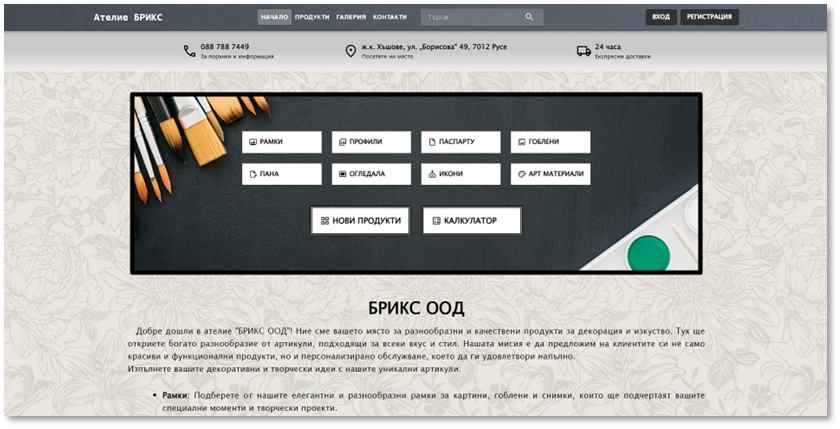
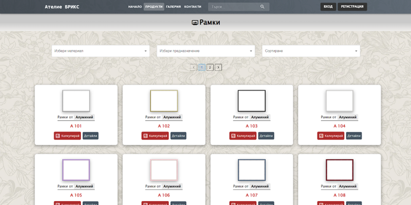
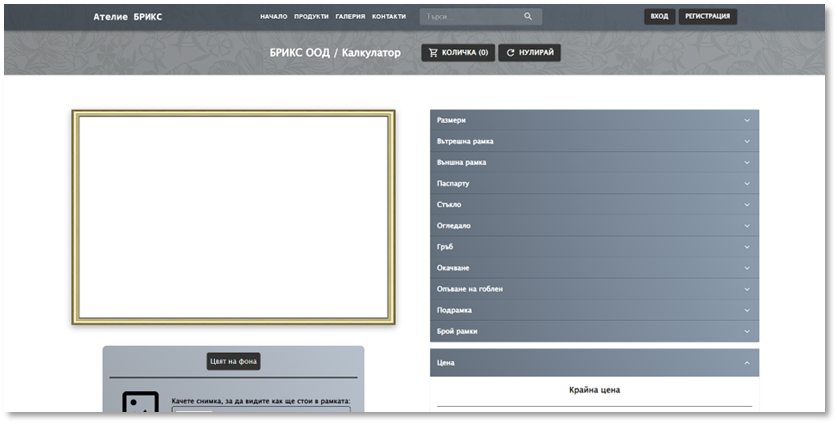
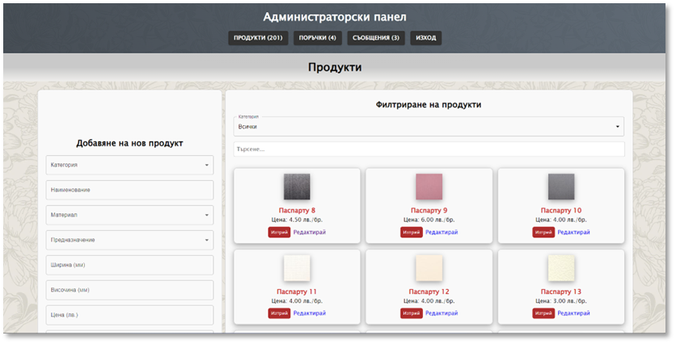

# Web-Atelier-System

This system was developed as part of my Bachelor's thesis. It is designed to manage product information and offers features for generating, visualizing, and calculating prices for customized projects. Tailored for an atelier, the system supports various profiles of picture frames, reproductions, tapestries, panels with applied materials, mirrors, icons and art materials.

One of the key features of this system is its dynamic price calculator, which takes into account the type of item, dimensions, materials, and other user-selected parameters to provide accurate pricing.

## Features

### User Features

- **User-Friendly Interface**: Provides intuitive navigation for quick access to product information and pricing.
- **Responsive Design**: Ensures a seamless experience on mobile devices, adapting to various screen sizes for optimal usability.
- **Dynamic Price Calculator**: Accurately computes prices using predefined formulas for various products.
- **Real-Time Product Visualization**: Allows users to visualize customized products instantly as they configure options.
- **Customizable Options**: Empowers users to select specific parameters to tailor products to their exact specifications.
- **Product Filtering**: Enables customers to filter products by various criteria, making it easy to find what they need.
- **Streamlined Order Placement**: Simplifies the process for customers to place orders directly through the system.
- **Customer Account Management**: Facilitates account creation for customers to manage their orders and preferences.
- **Direct Customer Messaging**: Provides a contact form for customers to send inquiries, ensuring prompt communication.

### Admin Features

- **Comprehensive Product Management**: Enables administrators to efficiently oversee products, including adding, editing, and deleting items.
- **Admin Dashboard**: Equips administrators with tools to view customer messages and track order history.

## Installation Instructions

The project can be run locally on localhost. Follow these steps:

1. Clone the repository: `git clone https://github.com/ivooo369/Web-Atelier-System.git`.
2. Navigate to the cloned directory.
3. Ensure Node.js is installed on your machine. Install dependencies with `npm install` in the project directory.
4. Install MySQL and import the provided SQL file for the database. Database connection settings are configured in the `.env` file.
5. Start the server with `npm start`. By default, it runs at `http://localhost:3000`.
6. Access the system in your web browser at `http://localhost:3000`.

## Usage Instructions

To access the admin dashboard, follow these steps:

1. Enter **http://localhost:3000/admin/login** in the URL bar of your web browser.
2. You will be directed to a login page where you need to enter your credentials.
   - **Username**: atelierBRIKS
   - **Password**: atelierBRIKS

After entering the username and password, you will gain access to the admin dashboard.

## Technologies Used

- **Frontend**: HTML, CSS, JavaScript, React, Material UI;
- **Backend**: Node.js, Express;
- **Database**: MySQL;
- **Development Tools**: Visual Studio Code, MySQL Workbench;
- **Testing**: React Testing Library, Vitest;
- **Cloud Services**: Cloudinary, Aiven, Render, GitHub;

## Live Demo

The project is hosted on Render, allowing you to explore its features and functionalities in real-time. You can view the live version of the project by clicking the link below:

[**View Live Demo**](https://website-project-lbpd.onrender.com)

## Screenshots

_Home Page - The primary page where users can browse and navigate through various product categories._

_Frame Page - A page displaying all products within the "Frames" category._

_Calculator Page - A page featuring a price calculator that also visualizes the configured custom project._

_Admin Dashboard Page - The main interface for administrators to manage products, view orders, and handle customer messages._

## Future Enhancements

- **Order History**: Implementing a feature for registered users to view their order history.
- **Project Sharing Forum**: Creating a forum for users to share and discuss their custom projects.
- **Multilingual Support**: Adding support for multiple languages to enhance accessibility for a diverse user base.

## Contributing

If you would like to contribute to this project, please fork the repository and submit a pull request.

## License

This project is licensed under the MIT License. See the [LICENSE](LICENSE) file for details.

## Contact Information

For questions or feedback, please contact me at [iveliniliev795@gmail.com].
